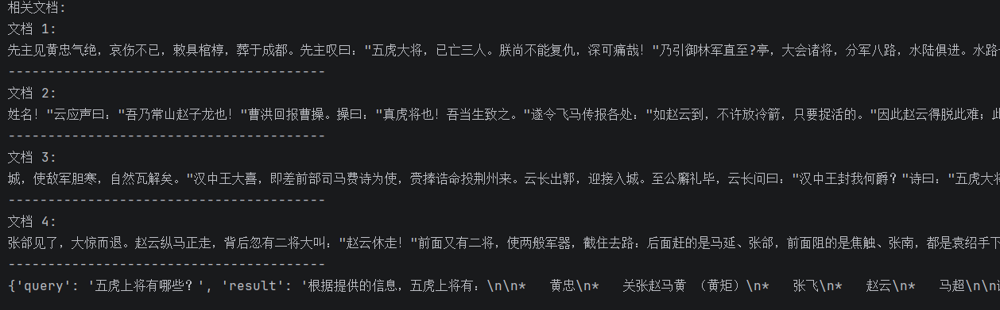
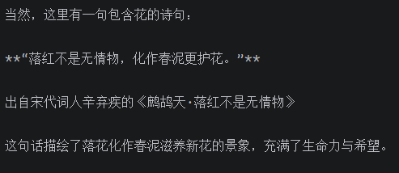

# Langchain-chain
“链（” Chains）指的是一个概念上的组件或模块，它能够处理输入并产生输出。  
旨在将大型语言模型（LLMs）与外部数据源和计算资源结合起来，以实现更强大的应用。
它通过三个核心组件来增强LLMs的功能：组件（Components）、链（Chains）和代理（Agents）。  

***  
本仓库代码项目为成语接龙
  
## 组件（Components）
组件为LLMs提供接口封装、模板提示和信息检索索引。它们允许开发者连接到大型语言模型，如GPT-4或Hugging Face提供的模型，并动态生成查询，避免硬编码。
## 链（Chains）
链将不同的组件组合起来解决特定任务。例如，在大量文本中查找信息。链条代表将多个步骤串联起来完成复杂任务的过程，使得开发者可以根据项目需求灵活选择和组合这些组件。
## 代理（Agents）
代理使得LLMs能够与外部环境进行交互，例如通过API请求执行操作。代理帮助构建复杂的应用程序，这些应用程序需要自适应和特定于上下文的响应。
## 工作流程
Langchain的工作流程可以概括为以下几个步骤：

1. 提问：用户提出问题。

2. 向语言模型查询：问题被转换成向量表示，用于在向量数据库中进行相似性搜索。

3. 获取相关信息：从向量数据库中提取相关信息块，并将其输入给语言模型。

4. 生成答案或执行操作：语言模型现在拥有了初始问题和相关信息，能够提供答案或执行操作。

## 应用场景
Langchain的应用场景非常广泛，包括但不限于：

- 个人助手：可以帮助预订航班、转账、缴税等。

- 学习辅助：可以参考整个课程大纲，帮助你更快地学习材料。

- 数据分析和数据科学：连接到公司的客户数据或市场数据，极大地促进数据分析的进展。

- 通过这些核心功能和工作原理，Langchain不仅使语言模型的应用更加强大和灵活，还大大降低了开发复杂度，使得开发者可以更加专注于创造价值。

# 复现实验以及成语接龙
本文使用的是gemma3
## 安装库
```text
pip install langchain==0.3.23
pip install langchain-openai==0.3.12
pip install sentence-transformers==3.3.0
pip install faiss-cpu==1.9.0
pip install langchain-huggingface==0.1.2
pip install langchain-community==0.3.21
```
**注意：**
如有在运行中有报错，并且编译器不支持，要通过pip安装需要安装 Microsoft C++ 构建工具
然后进行安装
```text
pip install langchain
```
如果你下载了conda，用虚拟环境，可以用下面指令来进行安装
```
conda install -c conda-forge langchain
```
也可以安装成功
## 下载模型
```
from modelscope.hub.snapshot_download import snapshot_download
emb_model_dir = snapshot_download('AI-ModelScope/bge-large-zh-v1.5',cache_dir='/models')
```

## 构建简单链
### llmchain
LLMchain 是一个简单的链，LLMChain由PromptTemplate和语言模型（LLM或聊天模型）组成。
其代码文件为langchain-llm
其结果如下：  

### 检索链RetrievalQA
检索链是Langchain中的一种特殊类型的链，主要用于从大量的文档数据集中检索相关信息，并且通常与向量数据库
（如Chroma、Pinecone、Faiss等）结合使用。  
检索链可以帮助我们在处理如知识库查询、文档搜索等场景时，更有效地找到相关的文档片段，并且利用这些文档片
段来生成准确的回答。  

其代码文件为langchain-QA
其结果如下：  


### 自定义链
通过Langchain LCEL表达式可以轻松自定义链。例如构造一条简单链接受用户的输入并给出回答。
其代码文件为langchain-lcel
其结果如下：   



## 成语接龙
其要求：要求根据成语文档进行成语接龙游戏，如果回答的成语不在文档中则判负
其代码如下
```python
# -*- coding: utf-8 -*-
# 时间 : 2026/3/30 09:08
# 作者 : mcy
# 文件 : 成语接龙.py
import re
import random
from langchain_community.vectorstores import FAISS
from langchain_huggingface import HuggingFaceEmbeddings
from langchain_community.document_loaders import TextLoader
from langchain.text_splitter import RecursiveCharacterTextSplitter
from langchain_openai import ChatOpenAI

# ---------------------- 模型配置 ----------------------
chat_model = ChatOpenAI(
    openai_api_key="ollama",
    base_url="http://localhost:11434/v1",
    model="gemma3:4b"
)

# ---------------------- 加载成语库 ----------------------
try:
    loader = TextLoader("成语大全.txt", encoding='utf-8')
    docs = loader.load()
except:
    print("❌ 请确保当前目录存在 成语大全.txt 文件！")
    exit()

# 读取所有成语（一行一个）
all_idioms = set()
for doc in docs:
    lines = doc.page_content.strip().split("\n")
    for line in lines:
        line = line.strip()
        if len(line) == 4:
            all_idioms.add(line)

print(f"✅ 成功加载成语数量：{len(all_idioms)} 个")

# ---------------------- 构建检索库 ----------------------
text_splitter = RecursiveCharacterTextSplitter(chunk_size=200, chunk_overlap=20)
chunks = text_splitter.split_documents(docs)

embedding = HuggingFaceEmbeddings(model_name='models/AI-ModelScope/bge-large-zh-v1___5')
vs = FAISS.from_documents(chunks, embedding)
retriever = vs.as_retriever(search_kwargs={"k": 20})

# ---------------------- 核心工具函数 ----------------------
def get_last_char(idiom):
    return idiom[-1]

def is_valid_idiom(idiom):
    """强制从本地成语集合判断，100%准确"""
    return idiom in all_idioms

def find_idioms_start_with(char):
    """直接从成语库找，不会空！"""
    candidates = [idiom for idiom in all_idioms if idiom.startswith(char)]
    return candidates

# ---------------------- 游戏主逻辑 ----------------------
def play_game():
    print("=" * 50)
    print("     🎮 LangChain + FAISS 成语接龙（修复版）")
    print("规则：必须在【成语大全.txt】中才算有效")
    print("=" * 50)

    # 起始成语
    while True:
        start = input("\n请输入起始成语：").strip()
        if is_valid_idiom(start):
            current = start
            print("✅ 成语有效，游戏开始！")
            break
        else:
            print("❌ 成语不在库中，请重新输入")

    round_num = 1

    while True:
        print(f"\n===== 第 {round_num} 轮 =====")
        print(f"当前成语：{current}")

        last = get_last_char(current)
        print(f"需要接：【{last}】开头")

        # AI 直接从成语库找（修复关键！）
        ai_list = find_idioms_start_with(last)
        if not ai_list:
            print("🎉 AI 无成语可用 → 你获胜！")
            break

        ai_idiom = random.choice(ai_list)
        print(f"🤖 AI 接龙：{ai_idiom}")

        # 玩家输入
        last_ai = get_last_char(ai_idiom)
        user = input(f"\n请你接【{last_ai}】：").strip()

        # 判断
        if not is_valid_idiom(user):
            print("❌ 你的成语不在库中 → AI 获胜！")
            break
        if not user.startswith(last_ai):
            print("❌ 首字不匹配 → 你输了！")
            break

        current = user
        round_num += 1

if __name__ == "__main__":
    play_game()
```
其结果如下
```text
✅ 成功加载成语数量：17768 个
==================================================
     🎮 LangChain + FAISS 成语接龙（修复版）
规则：必须在【成语大全.txt】中才算有效
==================================================

请输入起始成语：一心一意
✅ 成语有效，游戏开始！

===== 第 1 轮 =====
当前成语：一心一意
需要接：【意】开头
🤖 AI 接龙：意气风发

请你接【发】：发凡起例

===== 第 2 轮 =====
当前成语：发凡起例
需要接：【例】开头
🤖 AI 接龙：例行差事

请你接【事】：事半功倍

===== 第 3 轮 =====
当前成语：事半功倍
需要接：【倍】开头
🤖 AI 接龙：倍道而进

请你接【进】：进寸退尺

===== 第 4 轮 =====
当前成语：进寸退尺
需要接：【尺】开头
🤖 AI 接龙：尺水丈波

请你接【波】：波光粼粼

===== 第 5 轮 =====
当前成语：波光粼粼
需要接：【粼】开头
🎉 AI 无成语可用 → 你获胜！

```

# License
本项目仅用于学习、研究与学术交流。  
给我点个小星星吧，谢谢了！